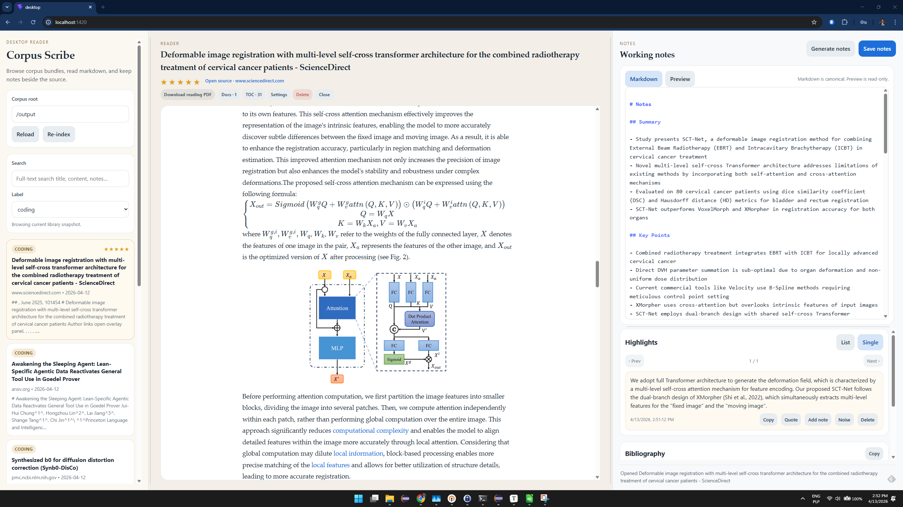
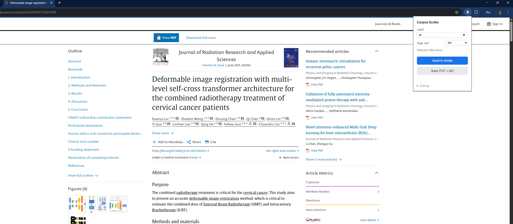
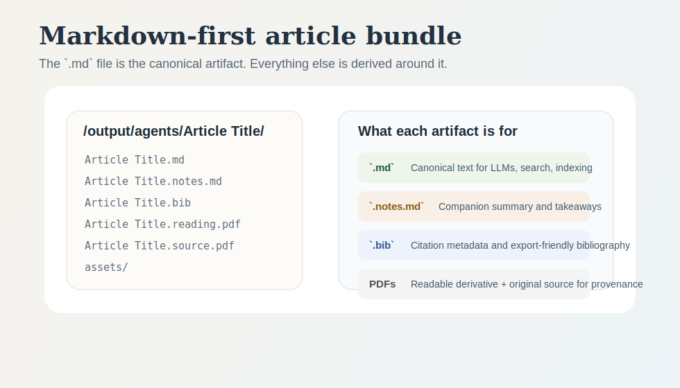

# Corpus Scribe

Corpus Scribe is a **Markdown-first research ingestion and corpus tool** for web articles and PDFs.

It captures messy publisher pages and source PDFs, normalizes them into **clean, durable article bundles**, preserves local assets, generates citation metadata, and optionally writes companion notes. The main artifact is always the saved Markdown. Reader views, notes, and reading PDFs are derived layers around that corpus.

It includes:

- a Chrome extension for one-click capture
- a Zotero plugin for sending library items with metadata and notes
- a Dockerized Flask backend
- a browser reader for search, reading, highlights, notes, and bibliography review

## At a glance





## What it is

Corpus Scribe is built for people who want a private local corpus that can be:

- read comfortably in a browser
- searched and indexed locally
- processed by scripts, local tools, and LLM workflows
- preserved in a format that stays useful outside this app

The core job is not "save pages to read later." The core job is:

1. capture technical content from the web or a source PDF
2. normalize it into a high-quality Markdown bundle
3. keep provenance and companion artifacts beside it
4. make that corpus usable for reading, annotation, and later machine-assisted work

## Why use it

- Build a personal research corpus in plain Markdown instead of scattered bookmarks, PDFs, and clipped HTML.
- Keep technical documents usable after capture: equations, tables, code blocks, images, bibliography, and notes survive much better than in generic clipping workflows.
- Create a corpus that is easier for local agents and LLM workflows to read, search, summarize, and link.
- Keep both provenance and usability in the same bundle:
  - original source PDF when applicable
  - canonical `.md`
  - optional `.notes.md`
  - optional reading PDF for Kindle or offline reading

## Best fit

Corpus Scribe is a good fit if you want to:

- build a personal knowledge base from articles, blog posts, papers, and technical documentation
- save papers into labeled folders like `ml`, `agents`, `biology`, or `ideas` and query them later with local tools
- keep a private markdown library with stable frontmatter, bibliography files, notes, and an index that scripts or agents can consume
- generate cleaner reading copies from difficult source PDFs without making the PDF workflow the center of the system

It is less about social bookmarking or casual read-it-later queues, and more about building a durable technical corpus.

## Core features

### Capture and extraction

- Save web articles and PDFs from Chrome into labeled bundles under `output/<label>/<article>/`
- Normalize publisher HTML into readable Markdown with equations, tables, code, figures, metadata, and local assets
- Preserve bibliography as a sibling `*.bib` file
- For source PDFs:
  - save the original file as `*.source.pdf`
  - extract Markdown with Mistral OCR when configured
  - fall back to `pdftotext` when OCR is unavailable or fails
  - generate a separate `*.reading.pdf` from cleaned Markdown

### Reader and library UI

- Browser-based reader and library workbench optimized for WSL + Windows Chrome
- Library search with local indexing and article quality stars
- Open-document switching, close current document, and persisted UI state
- Focus mode, dark mode, adjustable font size, and persisted reading position
- TOC popup for long documents
- External links open in a new tab
- Direct link to the original source page
- Download linked PDFs from the reader

### Highlights, noise, and notes

- Select text in the article and save highlights without reloading the document
- Inline visible highlights in the reader
- Highlight panel with list mode and single-item mode with next/previous navigation
- Click a highlight to center it in the reader
- Add comments to highlights and copy them to the clipboard
- Mark sections as `noise` with strikethrough styling and optionally hide them in the reader
- Optional `References = noise` mode for cleaner reading and lower-token LLM workflows
- Notes pane with two modes:
  - `Markdown` editing
  - `Preview` rich rendered view
- Markdown syntax coloring in the notes editor
- Typora-style keyboard shortcuts for fast markdown editing
- Generate companion notes for an existing article bundle from the UI

### Reader utilities

- Copy code blocks
- Copy equations as LaTeX
- Copy tables as CSV
- Open images in full resolution
- Copy images to the clipboard

### Corpus structure and indexing

- Markdown is the canonical artifact
- Annotation layers such as highlights, notes, and noise stay attached to the article bundle instead of replacing the source
- Stable YAML frontmatter for indexing and downstream processing
- Generated `index.jsonl` at the corpus root
- Companion artifacts around the main article:
  - `*.notes.md`
  - `*.bib`
  - `*.highlights.json`
  - `*.source.pdf`
  - `*.reading.pdf`

## Project structure

```
corpus-scribe/
  docker-compose.yml
  output/                     # saved PDFs and Markdown
  backend/
    Dockerfile
    main.py                   # Flask API
    article_extractor.py      # article extraction + HTML/MD/PDF pipeline
    send_email_gmail.py       # Gmail API (Kindle delivery)
    requirements.txt
    test_article_extractor.py # end-to-end extractor regression tests
  extension/
    manifest.json             # Chrome Manifest V3
    popup.html / popup.js     # extension UI
    background.js
    assets/
  zotero-plugin/
    manifest.json             # Zotero WebExtension manifest
    bootstrap.js              # lifecycle hooks (startup/shutdown)
    prefs.js                  # default preferences
    content/
      corpus-scribe.js        # plugin logic (menu, upload, metadata)
      preferences.xhtml       # settings pane
  desktop/
    src/                      # browser reader + notes/highlights UI
    vite.config.ts
```

## Quick start

```bash
./scripts/compose-with-home-env.sh up -d --build backend
```

The backend starts on `http://localhost:5000`. Saved files appear in `./output/<label>/<article>/`.
The canonical artifact is the saved `.md` file. Notes, bibliography, source PDFs, and reading PDFs are derived artifacts around that markdown core.
The backend container runs as `${UID:-1000}:${GID:-1000}` by default so files created under `./output/` stay owned by your host user.

If you want markdown and image assets to open cleanly in Windows apps from outside WSL, point the output mount at a Windows-backed folder.
Create a `.env` file from `.env.example` and set:

```bash
HOST_OUTPUT_DIR=/mnt/c/Users/<you>/Documents/corpus-scribe
```

Then restart the backend with:

```bash
./scripts/compose-with-home-env.sh up -d --build backend
```

Inside the container the backend still writes to `/output`, but Docker will map that to your configured host folder.

### Chrome extension

1. Open `chrome://extensions/`
2. Enable **Developer mode**
3. Click **Load unpacked** and select the `extension/` directory
4. Navigate to any article or PDF and click the extension icon
5. Choose or create a **Label** in the popup
6. The popup will show what it detected:
   - `Detected: Web article`
   - or for PDFs:
     - `Detected: PDF`
     - `Extraction: Mistral OCR`
     - or `Extraction: pdftotext fallback`
7. Choose **Save PDF + MD** or **Send to Kindle**

The primary workflow is:

- capture article or PDF
- store it under a label
- keep the markdown as the main artifact
- optionally generate notes and reading PDFs

Kindle delivery is supported, but it is an export path, not the center of the system.

### Zotero plugin

The Zotero plugin sends library items directly from Zotero to the Corpus Scribe backend. It works with Zotero 7 and 8.

What it does:

- Right-click one or more Zotero items and choose **Send to Corpus Scribe**
- The plugin reads the PDF attachment, extracts Zotero metadata (title, authors, DOI, date, publication, abstract, etc.), and uploads everything to the backend
- If the Zotero item has child notes, they are converted from HTML to Markdown and sent as working notes
- The backend processes the PDF through the standard extraction pipeline (Mistral OCR or pdftotext fallback) with the Zotero metadata taking precedence over OCR-extracted metadata
- A label prompt lets you file the item into an existing or new corpus label

Installation:

1. Build or download `zotero_plugin.zip` from the `zotero-plugin/` directory
2. In Zotero, go to **Tools → Add-ons**
3. Click the gear icon → **Install Add-on From File** and select the `.zip`
4. Open the plugin preferences (Zotero **Settings → Corpus Scribe**) and configure:
   - **API Base URL** — the backend address (default `http://127.0.0.1:5000`)
   - **API Key** — must match the backend `API_KEY` (default `api-key-1234`)
   - **Page Size** — reading PDF page size (A4, A5, or Letter)

## Reader UI

There is now a browser reader in [desktop/](desktop) that acts as a workbench over the saved corpus:

- library browser on the left
- markdown reader in the center
- notes, highlights, and bibliography on the right
- local indexed search over article, notes, and highlight text
- article quality stars directly in the library
- independently scrolling panes
- draggable splitters for resizing the side panels
- persisted UI state such as selected label, display mode, and view preferences

It reads the existing Corpus Scribe bundle layout directly instead of introducing a new storage model. The reader is intentionally downstream of the saved corpus: if you stop using the UI, the Markdown bundles remain usable on their own. The reader runs as a normal web app and talks to the Flask backend through local `/desktop/*` endpoints.

From the repo root:

```bash
./scripts/compose-with-home-env.sh up -d --build backend
cd desktop
npm install
npm run dev
```

Then open:

```text
http://localhost:1420/
```

On WSL, opening that URL in Windows Chrome is the recommended path. This is the primary supported reader workflow.

The compose wrapper above sources `~/.env` first, so backend-only secrets such as `NOTES_LLM_API_KEY` and `MISTRAL_API_KEY` can stay in your home environment instead of the repo-local `.env`.

### Reader workflow

The current browser UI supports:

- browse and search the corpus
- open multiple documents and switch between them quickly
- read the full article without an extra "load full article" step
- create visible inline highlights
- mark low-value sections as `noise`
- write Markdown notes and switch to rich preview
- generate notes from the current article on demand
- inspect bibliography and copy citation data
- jump through highlights and back to the relevant article location

### Bundle layout



## MCP server

Corpus Scribe includes a [Model Context Protocol](https://modelcontextprotocol.io/) (MCP) server that exposes the library to any MCP-compatible host — Claude Desktop, Claude Code, Cursor, or custom agents. The server lives in `scripts/scribe.py` and runs as a stdio transport, so the host spawns it directly rather than connecting to an HTTP endpoint.

### Why MCP

The MCP layer turns the corpus into a tool-equipped knowledge base that an LLM can navigate during conversation. Without it, the LLM would need the full text of every relevant article pasted into context. With it, the LLM can search, triage, and selectively read only the parts it needs — the same way a human skims a table of contents before reading a section.

### Setup

Add a server entry to your MCP host configuration. For Claude Desktop or Claude Code, add to the MCP settings:

```json
{
  "mcpServers": {
    "scribe-mcp": {
      "command": "python",
      "args": ["/path/to/send-to-scribe/scripts/scribe.py", "mcp-server"],
      "env": {
        "SCRIBE_API_BASE": "http://127.0.0.1:5000"
      }
    }
  }
}
```

The `mcp` Python package must be installed in the environment the host uses to spawn the server (`pip install mcp` or `uv tool install mcp`). The Flask backend must be running.

### Tools

The server exposes 13 tools. They fall into four groups:

**Context and navigation**
- `get_current_context` — what the desktop reader currently has open (focused document, open tabs, label filter)
- `list_labels` — top-level corpus folders
- `list_documents` — compact metadata list, optionally filtered by label
- `search` — PubMed-style field queries (`(CSD[Title]) AND (Tournier JD[Author])`)

**Reading**
- `read_document` — full article body with noise and references stripped by default
- `list_sections` — heading outline with per-section character counts
- `read_section` — a single section by heading, case-insensitive match

**Highlights and notes**
- `get_highlights` — user-saved highlights with comments (noise-variant excluded)
- `read_notes` — companion `.notes.md` body
- `append_notes` — additive write to notes without replacing existing content
- `update_notes` — whole-file replace of notes

**Related documents**
- `get_related` — user-curated related-document links for cross-paper navigation

### Optimized reading for context efficiency

Academic papers in the corpus can be 50k–150k characters. Loading full documents into an LLM's context window is expensive and often unnecessary — most tasks only need a few sections. The MCP server provides a progressive-disclosure reading pattern that keeps context token usage low:

1. **`list_sections`** fetches the document outline without any body text. Each entry includes the heading name, nesting level, and character count, so the LLM can see the structure of a 100-page paper in a few hundred tokens and decide which parts matter.

2. **`read_section`** fetches a single section by heading (case-insensitive, with prefix-match fallback). Only the targeted slice — including nested subsections — enters the context. A typical section is 2k–10k characters instead of the full 100k.

3. **`read_document`** with `stripNoise=true` (default) removes content the user has marked as noise — author affiliations, page headers, boilerplate. Setting `stripReferences=true` (also default) drops the references section, which in academic papers can be 20–40% of the total length. Together these flags can cut a document's token footprint in half before the LLM sees it.

The recommended workflow for a long paper is: `list_sections` to survey, then `read_section` for the parts that matter. Reserve `read_document` for short articles or when the user explicitly asks for the full body.

For cross-paper research, `search` and `list_documents` return compact metadata (title, authors, rating, DOI, excerpt) — enough to triage dozens of candidates without reading any bodies. Follow up with `get_highlights` on promising hits: highlights are typically a few hundred tokens and represent what the user already considered important.

### CLI mirror

The same `scripts/scribe.py` file doubles as a CLI that mirrors the core MCP tools:

```bash
python scripts/scribe.py search "diffusion models"
python scripts/scribe.py read /output/ml/Paper/Paper.md
python scripts/scribe.py context
python scripts/scribe.py update-notes /output/ml/Paper/Paper.md --from-file notes.md
```

Pass `--json` for machine-readable output. The CLI uses only the Python standard library and does not require the `mcp` package.

## API

All endpoints accept JSON with an `apiKey` field for authentication (default: `api-key-1234`, configurable via `API_KEY` env var).

### `POST /save_local`

Extract article and save PDF + Markdown to the output directory.

```json
{
  "apiKey": "api-key-1234",
  "label": "Machine Learning",
  "url": "https://example.com/article",
  "html": "<html>...</html>",
  "cookies": {"domain": {"name": "value"}}
}
```

Response:
```json
{
  "success": true,
  "title": "Article Title",
  "label": "Machine Learning",
  "primary": "/output/Machine Learning/Article Title/Article Title.md",
  "pdf": "/output/Machine Learning/Article Title/Article Title.pdf",
  "bib": "/output/Machine Learning/Article Title/Article Title.bib",
  "notes": "/output/Machine Learning/Article Title/Article Title.notes.md",
  "pdfAvailable": true,
  "notesAvailable": true,
  "md": "/output/Machine Learning/Article Title/Article Title.md",
  "metadata": {
    "source_site": "example.com",
    "citation_key": "doe2026articletitle",
    "doi": "10.1000/example",
    "language": "en",
    "word_count": 1234,
    "image_count": 4,
    "ingested_at": "2026-04-12T10:00:00+00:00"
  }
}
```

Optional `notes` request overrides for local saves:

```json
{
  "notes": {
    "provider": "openai",
    "model": "gpt-4.1-mini",
    "base_url": "https://api.openai.com/v1",
    "api_key": "sk-..."
  }
}
```

### `POST /save_pdf`

Download a source PDF, save the original PDF locally, extract markdown from the PDF with Mistral OCR when configured, and optionally generate companion notes. If OCR is unavailable or fails, the backend falls back to `pdftotext`.

For PDF-source saves, the backend keeps two PDF artifacts:

- `sourcePdf`: the original downloaded PDF for archival fidelity
- `pdf`: a regenerated reading PDF created from the cleaned markdown for better Kindle reading
- `bib`: a generated bibliography entry for citation workflows

```json
{
  "apiKey": "api-key-1234",
  "label": "Papers",
  "url": "https://example.com/paper.pdf",
  "sourceName": "paper.pdf",
  "cookies": {"domain": {"name": "value"}}
}
```

Response fields of interest:

```json
{
  "pdf": "/output/Papers/Article Title/Article Title.reading.pdf",
  "sourcePdf": "/output/Papers/Article Title/Article Title.source.pdf",
  "bib": "/output/Papers/Article Title/Article Title.bib",
  "pdfAvailable": true,
  "sourcePdfAvailable": true,
  "primary": "/output/Papers/Article Title/Article Title.md"
}
```

### `POST /save_pdf_upload`

Upload a PDF file directly with optional metadata overrides and working notes. This is the endpoint used by the Zotero plugin.

Accepts `multipart/form-data` with these fields:

| Field | Required | Description |
|---|---|---|
| `file` | yes | The PDF file |
| `apiKey` | yes | API authentication key |
| `label` | yes | Corpus label to file under |
| `pageSize` | no | Reading PDF page size (`a4`, `a5`, `letter`; default `a5`) |
| `sourceName` | no | Original filename |
| `metadata` | no | JSON string with citation overrides (`title`, `author`, `doi`, `date`, `url`, `container_title`, `publisher`, `volume`, `issue`, `pages`, `abstract`) |
| `note` | no | Markdown text to save as a `.notes.md` companion file |

Response:

```json
{
  "success": true,
  "title": "Article Title",
  "label": "Papers",
  "primary": "/output/Papers/Article Title/Article Title.md"
}
```

### `GET /labels`

List existing output labels so the extension can offer them in the save dialog.

Query params:

- `apiKey=...`

### `GET /capabilities`

Return lightweight backend capability information used by the popup.

Query params:

- `apiKey=...`

Response:

```json
{
  "success": true,
  "pdfOcr": {
    "available": true,
    "engine": "mistral",
    "fallback": "pdftotext"
  }
}
```

### `POST /generate_pdf`

Extract article and send PDF to Kindle via Gmail.

```json
{
  "apiKey": "api-key-1234",
  "url": "https://example.com/article",
  "html": "<html>...</html>",
  "cookies": {},
  "email": "you@gmail.com",
  "kindleEmail": "you@kindle.com"
}
```

### `GET /health`

Returns `{"status": "ok"}`.

## Kindle delivery setup

To use the **Send to Kindle** feature, you need Google OAuth credentials:

1. Create a project in [Google Cloud Console](https://console.cloud.google.com/)
2. Enable the Gmail API
3. Create OAuth 2.0 credentials (Desktop app type)
4. Download `credentials.json`
5. Uncomment the credential mounts in `docker-compose.yml`:
   ```yaml
   volumes:
     - ./output:/output
     - ./credentials.json:/app/credentials.json:ro
     - ./token.json:/app/token.json
   ```
6. On first run, the backend will open a browser for OAuth consent and save `token.json`

Also add your Gmail address to the **Approved Personal Document E-mail List** in your [Kindle settings](https://www.amazon.com/hz/mycd/myx#/home/settings/payment).

## Configuration

| Env variable | Default | Description |
|---|---|---|
| `API_KEY` | `api-key-1234` | API authentication key |
| `OUTPUT_DIR` | `/output` | Directory for saved PDFs and Markdown |
| `HOST_OUTPUT_DIR` | `./output` | Host-side bind mount target for `/output` in `docker-compose.yml` |
| `UID` | `1000` | UID used to run the backend container |
| `GID` | `1000` | GID used to run the backend container |
| `MISTRAL_API_KEY` | empty | Enables Mistral OCR as the primary PDF-to-markdown extractor |
| `MISTRAL_BASE_URL` | `https://api.mistral.ai` | Base URL for Mistral OCR API |
| `MISTRAL_OCR_MODEL` | `mistral-ocr-latest` | Mistral OCR model used for source PDFs |

## Extraction pipeline

1. The Chrome extension captures the current page's full HTML and cookies
2. The backend extracts the main article content, preferring a real `<article>` tag and falling back to [Readability](https://github.com/mozilla/readability) (`readability-lxml`) when needed
3. Images are downloaded with the captured browser cookies so paywalled/CDN-backed assets can still be resolved
4. Publisher-specific math wrappers are normalized before conversion:
   - PubMed/PMC display equations stored in `table.disp-formula` are unwrapped so they are treated as equations, not tables
   - ScienceDirect/MathJax blocks are normalized from embedded MathML or MathJax markup
   - real MathML is preserved whenever available
5. Presentation-only HTML is cleaned before markdown generation so the `.md` output is not polluted with layout wrappers and raw HTML blocks
6. Lists, code-listing tables, and figure wrappers are normalized before conversion so markdown readers do not get empty bullets, broken code blocks, or layout-only captions
7. Markdown is generated from normalized HTML with Pandoc, not `html2text`, so equations, tables, and code survive conversion much more reliably
8. The markdown file is written as the canonical saved artifact with structured YAML frontmatter for downstream indexing and LLM use
9. A sibling `*.bib` file is generated from the extracted citation metadata so each saved document has an immediately usable bibliography entry
10. Markdown is post-processed to remove same-document fragment links and other raw HTML artifacts that are harmless in browsers but noisy in markdown readers
11. Local saves can also generate a companion `*.notes.md` file using a local OpenAI-compatible model endpoint
12. PDF generation uses a straightforward markdown-first path:
   - Pandoc converts the generated markdown to HTML
   - the backend wraps that HTML in an academic print stylesheet
   - headless Chromium renders the final self-contained PDF without browser print headers or footers
13. PDF tabs use a native PDF source path instead of HTML extraction:
   - the backend downloads the source PDF with the captured browser cookies
   - Mistral OCR is the primary extractor for PDF-to-markdown conversion when `MISTRAL_API_KEY` is configured
   - the raw OCR response is cached as `ocr_response.json` beside the extracted files
   - `pdftotext` is only the fallback path for OCR-disabled or OCR-failed PDFs
   - OCR-derived markdown goes through a PDF-specific cleanup pass to unescape OCR HTML entities, normalize LaTeX spacing, and tighten inline math in prose
   - the original PDF is saved as `*.source.pdf`
   - a separate reading PDF is regenerated from the cleaned markdown and saved as `*.reading.pdf`
14. Local saves are written under `/output/<label>/<article>/`
15. Local saves are markdown-primary: if PDF rendering fails, the markdown still remains saved successfully
16. Files are either saved locally or emailed to Kindle via Gmail API

## Markdown metadata

Saved articles include YAML frontmatter intended to make the markdown corpus easier to index and query later. Current fields include:

- `doc_id`
- `doc_type`
- `title`
- `author`
- `date`
- `url`
- `canonical_url`
- `source_site`
- `label`
- `language`
- `description`
- `citation_key`
- `doi`
- `arxiv_id`
- `source_format`
- `source_file`
- `ocr_engine`
- `page_count`
- `word_count`
- `image_count`
- `ingested_at`
- `notes_file`
- `notes_doc_id`
- `bib_file`

For companion notes, the frontmatter also includes:

- `source_article`
- `source_doc_id`

## Companion notes

For local saves, the backend can generate a sibling `*.notes.md` file using a configurable LLM provider. The current default is Anthropic:

- `NOTES_LLM_PROVIDER` default: `anthropic`
- `NOTES_LLM_MODEL` default: `claude-sonnet-4-20250514`
- `NOTES_LLM_API_KEY` must be set for Anthropic notes generation

The notes file is a best-effort derived artifact intended for later review and LLM workflows. The canonical source remains the extracted article markdown.

Supported providers:

- `openai_compatible`
  Uses the OpenAI-style `POST /chat/completions` API. This works with local endpoints such as LM Studio.
- `openai`
  Also uses `POST /chat/completions`, but you typically point `NOTES_LLM_BASE_URL` at `https://api.openai.com/v1`.
- `anthropic`
  Uses `POST https://api.anthropic.com/v1/messages` with `NOTES_LLM_API_KEY` and `NOTES_ANTHROPIC_VERSION`.

Configuration can come from either:

- environment variables in `.env`
- per-request `notes` overrides sent to `POST /save_local`

## Knowledge Base Index

Local saves also maintain a generated `index.jsonl` file at the output root:

- `output/index.jsonl`

It contains one JSON object per saved article or notes file, including:

- `doc_id`
- `type`
- `title`
- `label`
- `path`
- `pdf_path`
- `source_pdf_path`
- `bib_path`
- `notes_path`
- `source_article_path`
- `source_doc_id`
- `url`
- `canonical_url`
- `source_site`
- `source_format`
- `ocr_engine`
- `citation_key`
- `doi`
- `arxiv_id`
- `language`
- `word_count`
- `image_count`
- `ingested_at`

The index is deterministic and path-based, so repeated saves update records instead of blindly appending duplicates.

## Math and table handling

- Math is not reconstructed from hardcoded Unicode replacement tables.
- The pipeline keeps MathML whenever possible and only uses fallback MathJax conversion when the source page no longer exposes real MathML.
- Display-formula wrapper tables are treated as equation containers and removed before markdown/PDF conversion.
- Real content tables remain tables and are converted by Pandoc into markdown tables and styled HTML tables.
- Syntax-highlighter layout tables are converted into semantic fenced/indented code blocks before markdown and PDF generation.
- Loose publisher list markup is normalized so `ul` and `ol` items do not turn into blank bullets or extra spacing.

## PDF rendering notes

- The PDF engine is headless Chromium.
- The backend renders the saved markdown through a fixed academic HTML/CSS template before printing to PDF.
- PDFs are self-contained because images are resolved to local assets before browser rendering.
- Browser print headers and footers are disabled, so the PDF does not include `file://` paths, timestamps, or page chrome.
- Unicode text is handled through generic normalization and cleanup, not symbol-by-symbol mappings.
- Code blocks are preserved from markdown and rendered with monospace print styling rather than being flattened into body text.
- For source PDFs saved via `POST /save_pdf`, the original document is preserved separately as `*.source.pdf`.
- The default `pdf` returned by `POST /save_pdf` is the regenerated reading copy `*.reading.pdf`.
- For source PDFs, markdown quality is best when `MISTRAL_API_KEY` is configured and the backend can use Mistral OCR.
- The popup surfaces the planned PDF extraction path before save and the actual OCR engine after save.
- Every saved article also gets a sibling `*.bib` file generated from the extracted citation metadata.

## Testing

The extractor has a regression test that exercises:

- PubMed-style display math wrappers
- ScienceDirect-style embedded MathML
- Unicode-heavy prose
- HTML table conversion
- PDF text extraction checks to verify equations are rendered instead of showing literal `$$`

Run it in the backend container:

```bash
docker compose exec -T backend python -m unittest -v test_article_extractor
```
